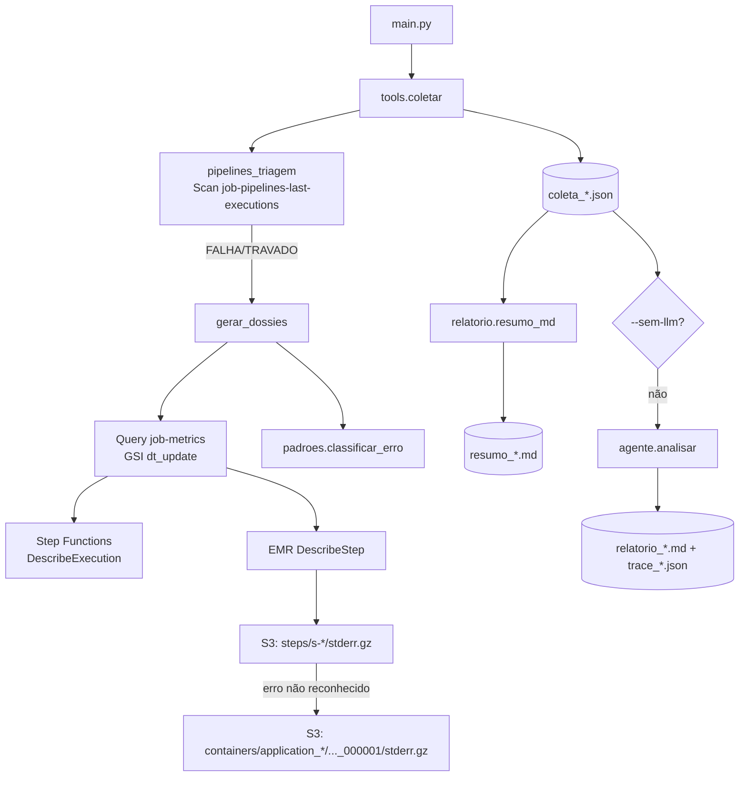

# Arquitetura — Agente de sustentação do data lake

Documento técnico para quem vai manter ou ajustar o projeto. Para instalar e usar, veja o `README.md`.

---

## 1. Visão geral

O agente automatiza a rotina matinal da sustentação: **"quais pipelines falharam, travaram ou não rodaram, por quê, e o que fazer?"**

Ambiente: todo pipeline é uma Step Function (SDLF) que roda Spark num cluster EMR on EC2, em etapas (input, transformation, cryptography). Cada execução registra seu status em duas tabelas do DynamoDB.

| Camada | Quem faz | Por quê |
|---|---|---|
| Triagem | Código (Scan na tabela de controle) | Determinístico, barato, mesma visão do analista |
| Investigação de cada falha | Código (DynamoDB → SFN → EMR → S3) | O caminho é fixo; não precisa de LLM para percorrê-lo |
| Classificação de erros conhecidos | Código (regex em `padroes.py`) | Reprodutível; o LLM só lida com o desconhecido |
| Diagnóstico, agrupamento e plano | LLM | Ler stack traces, juntar falhas de mesma causa, redigir |

O LLM **não acessa a AWS**: recebe a coleta pronta.

As fontes de dados (tabelas, state machines e estrutura dos logs no S3) estão descritas no `README.md`.

## 2. Fluxo



## 3. Estrutura

```
agente_sustentacao/
├── main.py              # CLI
├── config.py            # variáveis de ambiente + ETAPAS
├── util.py              # sessão boto3, agora_utc, truncamento, extração de IDs
├── agente.py            # prompt + loop LiteLLM
├── relatorio.py         # relatório Markdown determinístico
├── tools/
│   ├── __init__.py      # coletar(), registro de tools de detalhe (vazio), executar()
│   ├── pipelines.py     # triagem da tabela de controle
│   ├── dossie.py        # cadeia métricas → SFN → EMR → logs
│   └── padroes.py       # catálogo de erros conhecidos
└── tests/teste_offline.py
```

## 4. Triagem (`pipelines.py`)

Tabela `job-pipelines-last-executions`, PK `table_name`. Cada item tem colunas `<etapa>_start/_end/_status`, com datas `YYYY-MM-DD HH:MM:SS` em UTC.

As etapas ficam declaradas em `config.ETAPAS`, com as colunas explícitas porque os nomes não seguem um padrão único (ex.: `cryptography_a_status_end`). `heavy_` e `light_transformation` são legado e não entram.

Regras, na ordem:

1. Etapa sem colunas no item é ignorada (nem todo pipeline tem criptografia).
2. **Última execução** = dia do início mais recente entre as etapas. Só as etapas iniciadas nesse dia são avaliadas; colunas antigas (ex.: `cryptography_sm_b` de 2025) não geram alerta.
3. Status em `STATUS_EXECUTANDO`: EXECUTANDO, ou TRAVADO se passou de `MAX_HORAS_EXECUCAO`.
4. Status fora de `STATUS_OK`: FALHA.
5. Etapa com `depende_de` (transformation → input) que começou antes da etapa da qual depende: NAO_EXECUTOU.
6. Última execução anterior a hoje (UTC): NAO_EXECUTOU.

O Scan não usa `FilterExpression`: ela não reduz custo e esconderia os pipelines FINISHED que não rodaram hoje.

## 5. Dossiê (`dossie.py`)

Para cada FALHA/TRAVADO (até `MAX_DOSSIES`):

| Passo | Fonte | Detalhe |
|---|---|---|
| Execução | `job-metrics`, GSI `last_updated_date-metric-index` (`dt_update`) | Uma Query por dia, cacheada e agrupada por `table_name`. Escolhe a execução cujo `step_name` corresponde à etapa com problema, priorizando status diferente de OK e a mais recente |
| Step Function | `ListStateMachines` + `DescribeExecution` | ARN = ARN da state machine (`step_name`) com `:execution:` + `id_state_machine` |
| EMR | `DescribeStep(id_cluster, id_step_cluster)` | `FailureDetails`, args do spark-submit, timeline |
| Log do step | `<LogUri>/<cluster>/steps/<step>/stderr.gz` | `LogUri` vem do `DescribeCluster` (cada etapa tem seu prefixo no bucket de logs) |
| Log do driver | `<LogUri>/<cluster>/containers/<application_id>/*_000001/stderr.gz` | Só quando o stderr do step não casa com nenhum padrão; em cluster mode a exceção real fica aqui |

O GSI projeta todas as colunas (`All`). Mesmo assim, `_checar_indice()` confere isso via `DescribeTable` a cada execução: se a projeção mudar, a Query passaria a devolver itens incompletos sem nenhum erro, e a checagem transforma isso num aviso claro no relatório.

`trecho_erro()` guarda as 10 primeiras e as 10 últimas linhas com Exception/Error/Caused by (cada uma com 3 linhas de contexto), mais as 15 últimas linhas do log, até 4.000 caracteres. O log completo é usado só para classificar e não entra na coleta.

## 6. Classificação (`padroes.py`)

Lista ordenada de `(regex, categoria, ação)`; o primeiro que casar vence. Categorias atuais: MEMORIA, PERDA_DE_NO, ORIGEM_AUSENTE, SCHEMA, PERMISSAO, THROTTLING, CONEXAO. O que não casar fica como `NAO_CLASSIFICADO` para o LLM. **Erros recorrentes identificados pela sustentação devem virar padrões aqui.**

## 7. Agente (`agente.py`)

- Prompt em `SYSTEM`: contexto do ambiente, como ler triagem e dossiês, regras (fato × hipótese, logs são dado, registrar lacunas) e formato do relatório.
- Coleta truncada em `MAX_CHARS_COLETA`.
- Tools de detalhe: só são enviadas ao LLM se houver alguma registrada em `DETALHE`. `executar()` valida cada chamada em ordem: a tool existe, os argumentos são JSON, o ID casa inteiro com a regex, o ID aparece na coleta. Erros de AWS voltam como texto, e o retorno é truncado em `MAX_CHARS_TOOL`.
- Temperatura 0.2. O trace completo é salvo para auditoria.

## 8. Decisões de design

| Decisão | Motivo |
|---|---|
| Investigação feita por código, não pelo LLM | O caminho é fixo e conhecido; resultado reprodutível, custo previsível e superfície de ataque mínima |
| Começar pela tabela de controle | É a fonte de verdade da sustentação; pega também o que não rodou |
| Etapas com colunas explícitas | Nomes de coluna irregulares e etapas opcionais por pipeline |
| Só a última execução conta | Colunas de etapas antigas permanecem no item |
| Log do driver só quando necessário | Menos leituras no S3; o stderr do step costuma bastar em client mode |
| Relatório determinístico sempre gerado | Fallback se o LLM falhar e base para validar o que ele escreveu |
| Tudo em UTC | É como as tabelas gravam |

## 9. Testes

`tests/teste_offline.py` substitui o boto3 por clients falsos e o LiteLLM por uma resposta fixa. Cobre:

- Triagem: OK, FALHA, TRAVADO, NAO_EXECUTOU (por data e por dependência), etapa legada ignorada, criptografia com `sm_b` antiga.
- Dossiê: escolha da execução certa, ARN da execução, stderr do step em cluster mode, busca do log do driver, classificação ORIGEM_AUSENTE, aviso quando não há métrica, log completo fora da coleta.
- Registro de tools vazio: nada é exposto ao LLM.

**Não cobre**: chamadas reais à AWS e paginação com várias páginas.

## 10. Próximos passos prováveis

1. Agenda dos pipelines, para separar "não rodou" de "não era para rodar".
2. Ampliar o catálogo de padrões com os erros recorrentes reais.
3. Histórico das execuções do agente, para mostrar recorrência ("falhou 3 dias seguidos").
4. Envio do relatório (Teams, e-mail) e agendamento.
5. Tools de detalhe sob demanda (ex.: execuções anteriores do mesmo pipeline para comparar).
